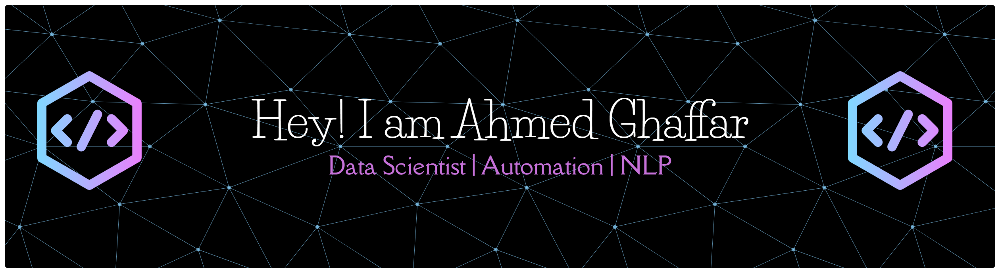

 

## 
🙋 Aʙᴏᴜᴛ ᴍᴇ

🎓 Data Science undergraduate at <strong>FAST-NUCES</strong>, based in Pakistan.

- 🤖 Interested in machine learning, AI, and applied predictive modeling
- ⚡ I enjoy automating workflows and cutting out repetitive manual work
- 📊 Comfortable across the full data pipeline — from raw data to a deployed model
- 🌱 Currently deepening my knowledge of deep learning architectures and RAG pipelines

---

## 
🚀 Fᴇᴀᴛᴜʀᴇᴅ ᴘʀᴏᴊᴇᴄᴛs

<table width="100%">
<tr>
<td width="50%" valign="top">
<h3>🕵️ Deepfake Detection (CNN)</h3>

Dual-branch CNN pipeline for deepfake detection, combining EfficientNet-B4 and XceptionNet, trained on FaceForensics++.

<code>Python</code> <code>PyTorch</code> <code>EfficientNet-B4</code> <code>XceptionNet</code>
  
<strong>→ <a href="#">Add repo link here</a></strong>
</td>
<td width="50%" valign="top">
<h3>🔎 RAG Pipeline (Parallel Embeddings)</h3>

Retrieval-augmented pipeline benchmarking sequential vs. parallel embedding generation, using FAISS for vector search and Groq's Llama 3.3 70B for generation.

<code>Python</code> <code>FAISS</code> <code>Groq API</code>
  
<strong>→ <a href="#">Add repo link here</a></strong>
</td>
</tr>
</table>

Send me the repo links (and any other projects you want featured) and I'll swap these in.

---

## 
🛠️ Tᴇᴄʜ sᴛᴀᴄᴋ

<strong>Languages</strong>

<picture>
  <source media="(prefers-color-scheme: dark)" srcset="https://skillicons.dev/icons?i=cpp,python,r&theme=dark">
  <source media="(prefers-color-scheme: light)" srcset="https://skillicons.dev/icons?i=cpp,python,r&theme=light">
  
</picture>

<strong>Data science &amp; ML</strong>

<picture>
  <source media="(prefers-color-scheme: dark)" srcset="https://skillicons.dev/icons?i=pytorch,sklearn&theme=dark">
  <source media="(prefers-color-scheme: light)" srcset="https://skillicons.dev/icons?i=pytorch,sklearn&theme=light">
  
</picture>
  

<strong>Backend &amp; tools</strong>

<picture>
  <source media="(prefers-color-scheme: dark)" srcset="https://skillicons.dev/icons?i=fastapi,flask,git,github,postman&theme=dark">
  <source media="(prefers-color-scheme: light)" srcset="https://skillicons.dev/icons?i=fastapi,flask,git,github,postman&theme=light">
  
</picture>
  

<strong>Design</strong>

<picture>
  <source media="(prefers-color-scheme: dark)" srcset="https://skillicons.dev/icons?i=figma,sass,ai,ps,ae&theme=dark">
  <source media="(prefers-color-scheme: light)" srcset="https://skillicons.dev/icons?i=figma,sass,ai,ps,ae&theme=light">
  
</picture>

---

## 
🏆 Gɪᴛʜᴜʙ ᴛʀᴏᴘʜɪᴇs

<a href="https://github.com/ahmedrana603">
<picture>
  <source media="(prefers-color-scheme: dark)" srcset="https://github-profile-trophy.vercel.app/?username=ahmedrana603&no-bg=true&no-frame=true&row=1&column=6&theme=dracula&margin-w=18">
  <source media="(prefers-color-scheme: light)" srcset="https://github-profile-trophy.vercel.app/?username=ahmedrana603&no-bg=true&no-frame=true&row=1&column=6&margin-w=18">
  
</picture>
</a>

## 
📊 Gɪᴛʜᴜʙ sᴛᴀᴛs

<table width="100%">
<tr>
<td width="50%">
<h3 align="center">Overview</h3>

</td>
<td width="50%">
<h3 align="center">Streak</h3>

</td>
</tr>
<tr>
<td width="50%">
<h3 align="center">Top languages</h3>

</td>
<td width="50%">
<h3 align="center">Top contributions</h3>

</td>
</tr>
</table>

If any card above shows blank: these are free shared Vercel instances that occasionally cold-start — a hard refresh usually fixes it.

---

## 
📈 Cᴏɴᴛʀɪʙᴜᴛɪᴏɴ ᴀᴄᴛɪᴠɪᴛʏ

<!--START_SECTION:snake-->
<picture>
  <source media="(prefers-color-scheme: dark)" srcset="https://raw.githubusercontent.com/ahmedrana603/ahmedrana603/output/github-contribution-grid-snake-dark.svg">
  
</picture>
<!--END_SECTION:snake-->

  

---

## 
🌟 Tʜᴏᴜɢʜᴛ ᴏғ ᴛʜᴇ ᴅᴀʏ

---

