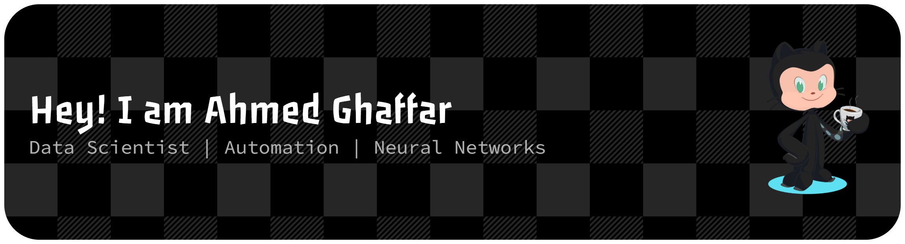
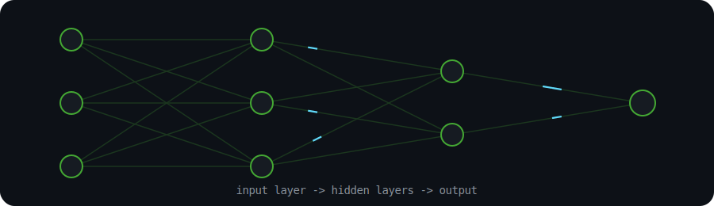

<!-- ================= TOP BANNER (custom) ================= -->

  

<!-- ================= TYPING ANIMATION ================= -->

  

<!-- ================= PROFILE VIEWS + SOCIALS ================= -->

  
  
  

---

## 🧑‍💻 About Me

I'm a Data Scientist in training who likes making machines learn things faster than I did.

- 🧠 Currently training neural networks and myself, in that order
- 🎓 Data Science undergrad at **FAST-NUCES**, buried in matrices and deadlines
- ⚙️ Obsessed with **automating anything that's repeated more than twice**
- 📈 I build models that predict things, then argue with the model when it's wrong
- 🛠️ Comfortable stack: Python, PyTorch, scikit-learn, and a lot of coffee
- 🚀 Currently exploring: process automation pipelines that think for themselves
- 📫 Let's talk data: **ghaffarahmed603@gmail.com**

---

## 🧠 Neural Network

  

---

## 🛠️ Tech Stack

**Languages**

**AI · ML · Data Science**

**Web · Backend**

**Design Tools**

**Dev Tools**

---

## 🐍 Contribution Activity

  

> ⚙️ This animates your real contribution graph into a snake eating your commit squares.
> It needs a tiny one-time GitHub Action setup — see the `snake.yml` file below and the setup notes I've included.

---

## 📊 GitHub Stats

  
  

  

  

---

## 🏆 Top Contributed Repo

  

---

### ✍️ Random Dev Quote

  

---

  

<!-- Proudly built with animated badges, Vercel-hosted stat APIs, and a GitHub Actions snake 🐍 -->
